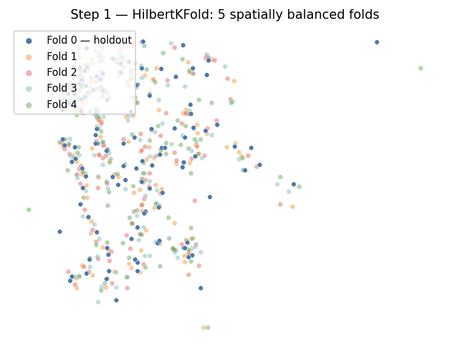
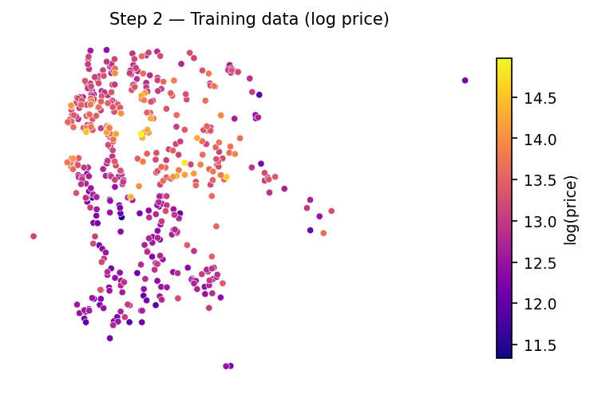
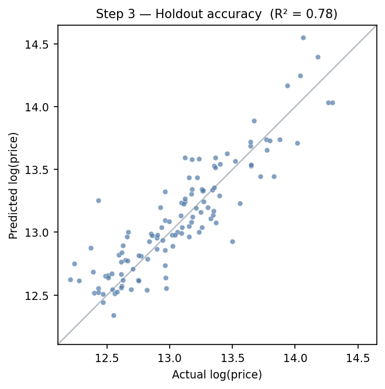
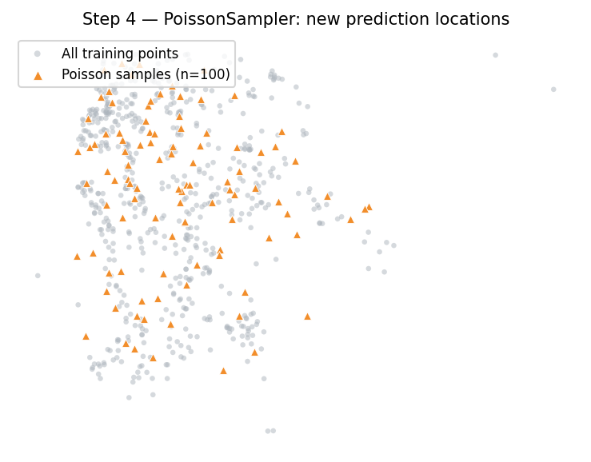
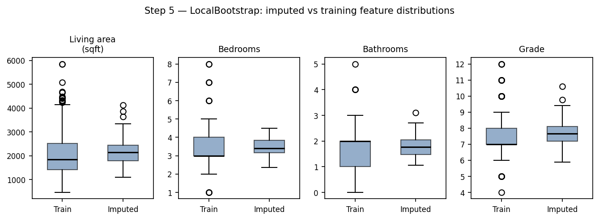
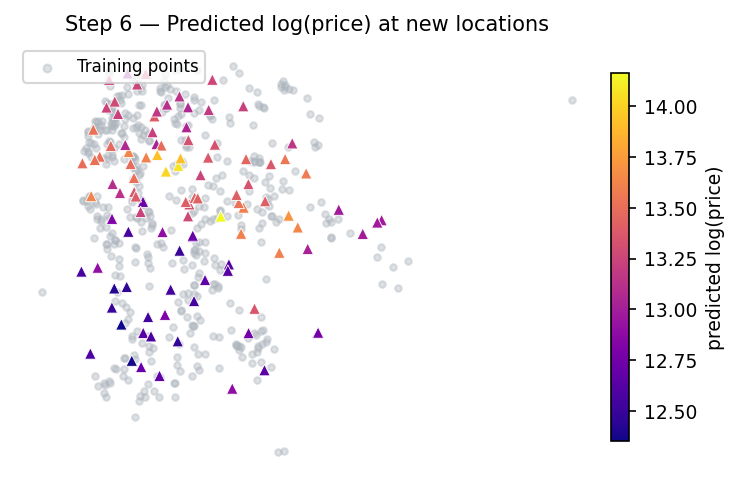
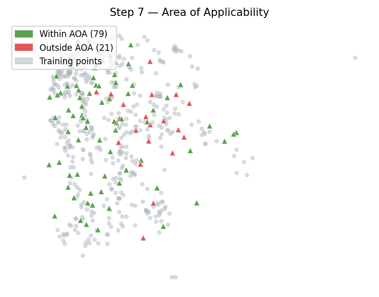

# geovalidate

Scikit-learn compatible tools for spatial model validation.

`geovalidate` provides spatial point samplers, spatially-aware cross-validators,
and prediction-quality metrics that slot directly into sklearn pipelines and
`cross_val_score` workflows.

## Installation

```bash
pip install -e ".[raster]"   # include rasterio for raster-based samplers
```

## Quick start

Split King County house-price data with `HilbertKFold`, hold out one fold,
sample new prediction locations in that fold's footprint, impute feature values
with a locally-weighted bootstrap from the training data, predict, and check
the Area of Applicability.

```python
from geovalidate import HilbertKFold, PoissonSampler, LocalBootstrap, area_of_applicability
```

<details>
<summary>Load King County house sales and take a stratified subsample (60 per price decile):</summary>

```python
import geopandas, geodatasets, numpy, pandas
gdf_full = geopandas.read_file(geodatasets.get_path("geoda.home_sales")).to_crs("EPSG:32610")
gdf_full["log_price"] = numpy.log(gdf_full["price"])
gdf_full["decile"] = (
    gdf_full["log_price"].rank(pct=True).multiply(10).clip(upper=9.99).astype(int)
)
idx = (
    gdf_full.groupby("decile")
    .apply(lambda g: g.sample(min(60, len(g)), random_state=42), include_groups=False)
    .index.get_level_values(1)
)
gdf = gdf_full.loc[idx].reset_index(drop=True)
feat_cols = ["sqft_liv", "bedrooms", "bathrooms", "grade"]
```
</details>

**1. Spatially balanced split** — split into 5 folds; hold out fold 0 as the
prediction target and train on the remaining four:

<details>
<summary>Code</summary>

```python
from geovalidate import HilbertKFold
hkf = HilbertKFold(n_splits=5, random_state=0)
train_idx, holdout_idx = list(hkf.split(gdf))[0]
gdf_train   = gdf.iloc[train_idx].reset_index(drop=True)
gdf_holdout = gdf.iloc[holdout_idx].reset_index(drop=True)
X_train = gdf_train[feat_cols].fillna(0)
y_train = numpy.log(gdf_train["price"])
```

</details>



**2. Fit a model** on the training folds using a geographically weighted random forest:

<details>
<summary>Code</summary>

```python
from gwlearn.ensemble import GWRandomForestRegressor
model = GWRandomForestRegressor(
    bandwidth=10000, fixed=True, kernel="bisquare",
    keep_models=True, coplanar="clique", random_state=0,
)
model.fit(X_train, y_train, geometry=gdf_train.geometry)
```

</details>



**3. Accuracy assessment** — predict at the known holdout locations and compare
to observed prices:

<details>
<summary>Code</summary>

```python
X_holdout = gdf_holdout[feat_cols].fillna(0)
y_holdout  = numpy.log(gdf_holdout["price"])
y_holdout_pred = model.predict(X_holdout, geometry=gdf_holdout.geometry)
```

</details>



**4. Sample new prediction locations** across the full study area using an
inhomogeneous Poisson process — intensity is a KDE fitted to the full dataset's point density:

<details>
<summary>Code</summary>

```python
from geovalidate import PoissonSampler
new_pts = PoissonSampler(n_expected=100, random_state=1).sample(
    gdf.geometry,
    intensity=gdf.geometry,
)
```

</details>



**5. Impute feature values** at the new locations from the training data —
`LocalBootstrap` draws donor rows from `gdf_train`, weighted by distance to each new point:

<details>
<summary>Code</summary>

```python
from geovalidate import LocalBootstrap
lb = LocalBootstrap(k=15, kernel="bisquare", n_bootstraps=50, random_state=2)
boot_samples = list(lb.sample(new_pts, donor=gdf_train))
X_new = pandas.DataFrame(
    numpy.mean([s[feat_cols].fillna(0).values for s in boot_samples], axis=0),
    columns=feat_cols,
)
```

</details>



**6. Predict** log(price) at the new locations:

<details>
<summary>Code</summary>

```python
log_price_pred = model.predict(X_new, geometry=new_pts.geometry)
```

</details>



**7. Check the Area of Applicability** — which new locations are close enough to the
training distribution for the model to be trusted?

<details>
<summary>Code</summary>

```python
applicable = area_of_applicability(X_new.values, X_train.values, feature_weights="uniform")
print(f"{applicable.sum()} / {len(applicable)} new points within AOA")
# 79 / 100 new points within AOA
```

</details>



## What's in the package

### Samplers

Generate spatial point samples from geometries, rasters, or intensity surfaces.

| Class | What it does |
|---|---|
| `PointSampler` | Uniform random points inside any Shapely geometry |
| `ConstantClassSampler` | Exactly *n* points per class |
| `StratifiedClassSampler` | Fixed total allocated proportionally to a weight column |
| `MultinomialSampler` | Stochastic class-count allocation via multinomial draw |
| `PoissonSampler` | Inhomogeneous Poisson process; intensity from a callable, raster, polygon values, or KDE over existing points |

All samplers accept `quasi_random="sobol"`, `"halton"`, or `"r2"` for
low-discrepancy sequences with better spatial coverage than pure random sampling.

### Cross-validators

All cross-validators follow the sklearn splitter protocol (`split(X)` yields
`(train_idx, test_idx)` pairs) and work directly with `cross_val_score`.

| Class | What it does |
|---|---|
| `HilbertKFold` | Interleaves points along a Hilbert space-filling curve so every fold covers the whole study area (Lister & Scott, 2009) |
| `BallKFold` | Conflict-graph colouring: no two test points in the same fold are within radius *r* of each other (Ploton et al., 2020) |
| `LeaveBallOut` | Leave-one-out with an exclusion buffer: training points within radius *r* of the test point are dropped (Ploton et al., 2020) |
| `ClusterStratifiedKFold` | Fits a user-supplied clusterer (HDBSCAN, KMeans, …) and stratifies each cluster across folds (Ploton et al., 2020) |
| `LeaveClusterOut` | Leave-one-cluster-out: holds out one spatial cluster per fold as the test region (Roberts et al., 2017) |
| `CellStratifiedKFold` | Assigns observations to discrete global grid system (DGGS) cells and stratifies each cell across folds (Ploton et al., 2020) |
| `LeaveCellOut` | Leave-one-DGGS-cell-out: holds out one grid cell per fold as the test region (Roberts et al., 2017) |
| `LocalBootstrap` | Locally-weighted bootstrap with replacement; bandwidth or *k*-NN neighbourhood (Statham, 2024) |
| `LocalPermutation` | Locally-constrained derangement (permutation without replacement) (Kim et al., 2022) |

`correlogram_range` and `knn_range` auto-detect a sensible bandwidth / *k* from
the empirical spatial autocorrelation of the response variable.

### Metrics

| Function | What it does |
|---|---|
| `area_of_applicability` | Meyer & Pebesma (2021) Dissimilarity Index and AOA mask; feature weights from permutation importance, uniform, or user-supplied array |
| `homogeneity` | Nowosad & Stepinski (2018) V-measure component, measuring how well-grouped one set of polygons is into another set of regions. (from [`esda`](https://github.com/pysal/esda))|
| `completeness` | Nowosad & Stepinski (2018) V-measure component, measuring how well a set polygons partitions a set of regions.(from [`esda`](https://github.com/pysal/esda)) |
| `v_measure` | Nowosad & Stepinski (2018) measure of how strongly-related two sets of regions or spatial classifications are. Harmonic mean of `homogeneity` and `completeness`. (from [`esda`](https://github.com/pysal/esda))|
| `areal_entropy` | entropy of area distribution of polygon area sizes (from [`esda`](https://github.com/pysal/esda))|
| `overlay_entropy` | entropy of the area distribution of polygons split by regions. (from [`esda`](https://github.com/pysal/esda))|
| `boundary_silhouette` | Wolf, Knaap, and Rey (2017) Silhouette statistic measuring the strength of specific regionalization boundaries (from [`esda`](https://github.com/pysal/esda))|
| `path_silhouette` | Wolf, Knaap, and Rey (2017) Silhouette statistic measuring the goodness of fit of a regionalization (from [`esda`](https://github.com/pysal/esda))|
| `correlogram` | Moran correlogram, displaying autocorrelation in the input data as a function of distance (from [`esda`](https://github.com/pysal/esda))
| `gearygram`| Correlogram built from Geary's C (from [`esda`](https://github.com/pysal/esda)) admitting multivariate inputs. 
| `correlogram_range` | The distance at which the Moran correlogram first crosses zero, measured using a distance decay spatial weight |
| `knn_range` | The distance at which the Moran correlogram first crosses zero, measured as a number of nearest neighbors |

## Examples

Runnable notebooks are in the [documentation](https://ljwolf.org/geovalidate/dev/examples/):

| Notebook | What it shows |
|---|---|
| `hilbert_kfold.ipynb` | Fold assignment along the Hilbert curve; comparison with random KFold |
| `ball_kfold.ipynb` | Spatially exclusive folds; the exclusion guarantee; `radius=` vs `n_splits=` modes |
| `leave_ball_out.ipynb` | Buffered leave-one-out CV; exclusion buffer visualised; RMSE vs standard LOO |
| `cluster_stratified_kfold.ipynb` | HDBSCAN clusters on King County sales; noise-handling policies including `nearest` |
| `leave_cluster_out.ipynb` | Leave-one-cluster-out; comparison of `train_only`, `drop`, and `nearest` noise handling |
| `cell_stratified_kfold.ipynb` | DGGS-stratified folds using H3; fold coverage vs random KFold |
| `leave_cell_out.ipynb` | Leave-one-DGGS-cell-out; `min_test_size` and auto-resolution |
| `local_bootstrap.ipynb` | Locally-weighted resampling; bandwidth selection |
| `local_permutation.ipynb` | Constrained derangement; comparison with unconstrained permutation |
| `range_finding.ipynb` | `correlogram_range` and `knn_range` for auto bandwidth selection |

## sklearn compatibility

Every class is a `BaseEstimator` subclass — `get_params()` / `set_params()` and
`GridSearchCV` work out of the box.

## AI Usage Statement

Claude code has been used to assist with test and documentation development, in addition to implementing additional features within human-authored classes. 